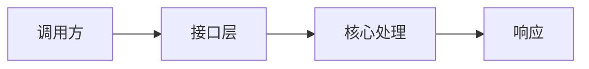

# API契约模板

````md
# 接口标题

## 元信息

| 项目 | 值 |
| --- | --- |
| 作者 | 待补 |
| 维护人 | 待补 |
| 状态 | 已完成 |
| 创建日期 | YYYY-MM-DD |
| 最后更新 | YYYY-MM-DD |

## 概述

## 文档定位

## 真相源

| 来源 | 负责内容 |
| --- | --- |
| `path/to/handler` | 待补 |
| `path/to/contract` | 待补 |

## 文档边界

## 通用契约

## 入口与结构图



## 主题展开

## 变更记录
````